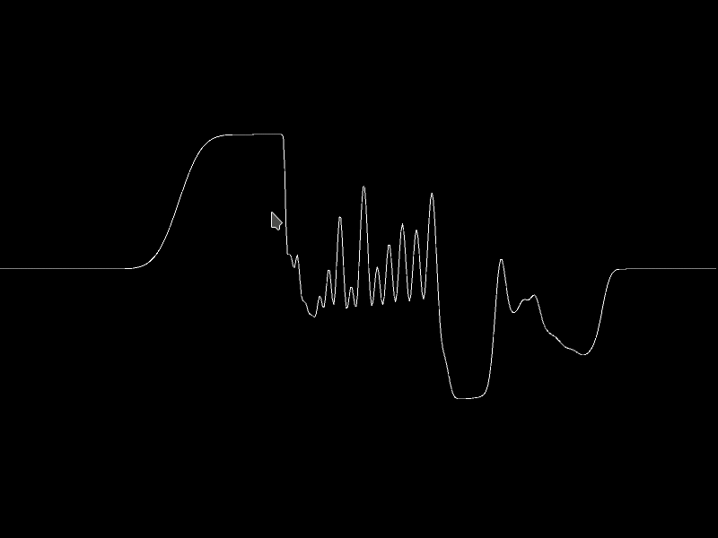
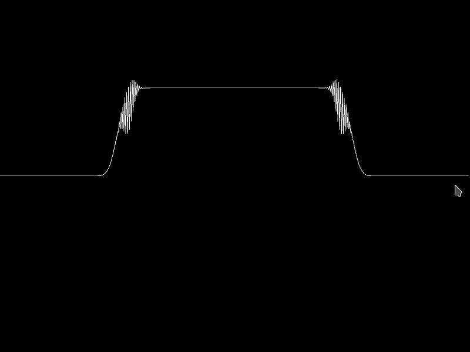

This incremental project intends to implement a discrete 2D Navier-Stokes model
in Kivy starting from 1D diffusion and working our way up.

Diffusion in 1D:

Burgers in 1D:

Navier Stokes in 2D with external flow and random noise:

